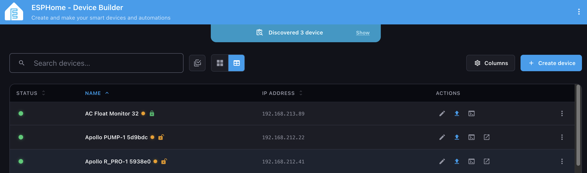
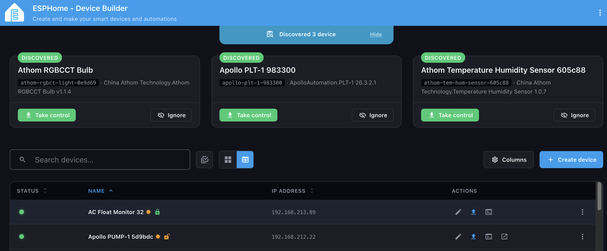
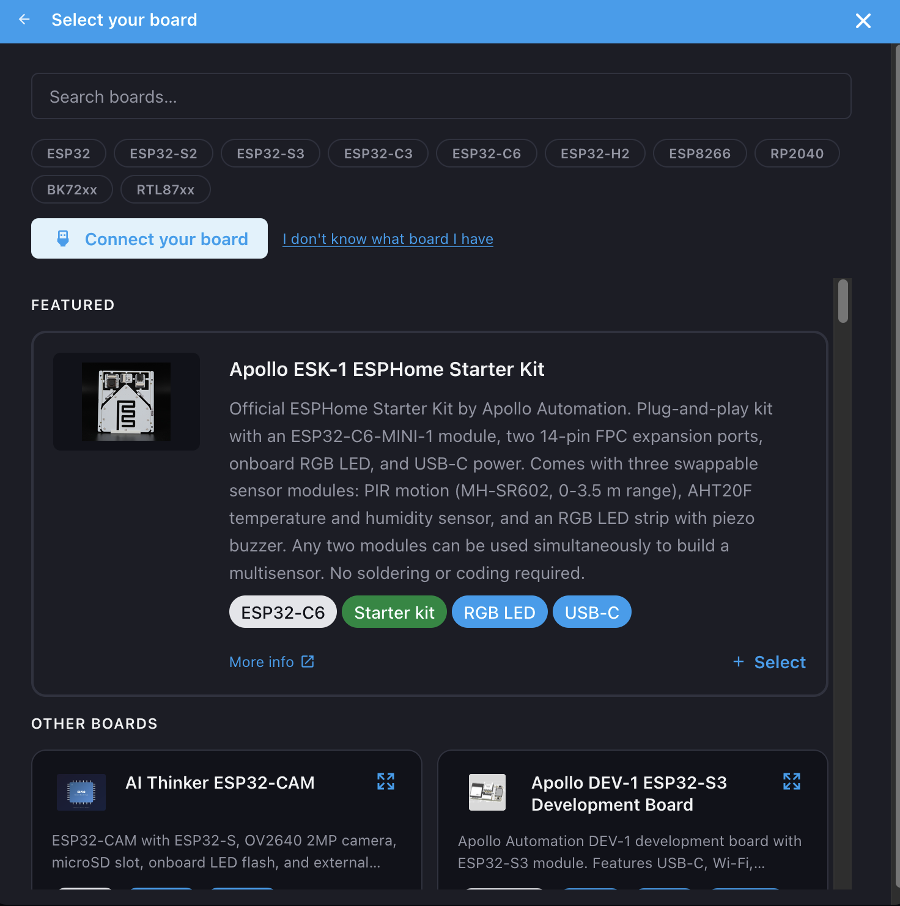

# ESPHome Device Builder Dashboard — Frontend

A web-based dashboard for managing, configuring, and deploying ESPHome IoT device firmware. Built with Lit web components and TypeScript.

> **This repository contains the frontend source only.** The dashboard runs as part of the **[ESPHome Device Builder Dashboard](https://github.com/esphome/device-builder)**, which ships a prebuilt copy of this frontend bundled in. End users should follow the install / run instructions in the backend repo — there's nothing to deploy from here on its own.

## Screenshots

Configured devices in the table view, with the discovered-devices banner above:



Discovered devices expanded — each card surfaces the project metadata and offers a one-click "Take control" adoption flow:



Create-device wizard's board picker — searchable, filterable by chip family, with curated featured boards up front:



## Tech stack

- **[Lit](https://lit.dev/)** — Web components framework
- **TypeScript** — Strict mode throughout
- **[Rspack](https://rspack.dev/)** — Rust-based bundler
- **[Web Awesome](https://www.webawesome.com/)** — UI component library (Home Assistant variant)
- **[CodeMirror](https://codemirror.net/)** — YAML editor with syntax highlighting
- **[Sonner](https://sonner.emilkowal.dev/)** — Toast notifications

## Backlog

Before filing anything, take a look at the **[shared backlog](https://github.com/orgs/esphome/projects/7/views/1?filterQuery=project%3A%22device-builder-dashboard%22)** — it lists everything that's already planned, in progress, or shipped for the dashboard. Saves duplicates and gives you a feel for where the project is heading.

## Issues and feature requests

The new-issue chooser on this repo only surfaces redirect links — there's no way to file a generic issue here.

- **🐛 Bugs** → [backend issue tracker](https://github.com/esphome/device-builder/issues). UI bugs go there too so we can triage everything in one place.
- **💡 Feature ideas** → [ESPHome org discussions](https://github.com/orgs/esphome/discussions) or the [dashboard Discord channel](https://discord.gg/Rf2jWGVjaK) where the new UI is actively discussed and feedback is being collected. Once a request is shaped enough to be actionable a maintainer adds it to the backlog above.

## Contributing — local development

The rest of this README is for developers working on the frontend itself. If you just want to run the dashboard, head over to the [backend repo](https://github.com/esphome/device-builder) and follow its setup.

### Prerequisites

- Node.js 22+ (with npm)
- A running ESPHome Device builder backend on `localhost:6052` — clone and run [device-builder](https://github.com/esphome/device-builder) in dev mode in a separate terminal

### Install

```bash
npm install
```

### Dev server

```bash
npm run dev
```

Starts an HMR dev server at `http://localhost:5173`. WebSocket and REST traffic are proxied to the backend at `localhost:6052`.

### Production build

```bash
npm run build
```

Outputs the bundled assets into `esphome_device_builder_frontend/` — that directory doubles as the Python package source for the wheel that ships with the backend release. The `__init__.py` exposing the asset path is sourced from `public/__init__.py` and copied into place by the bundler.

To produce the wheel locally (matches what CI builds on release):

```bash
npm run build
python3 -m build --wheel
# wheel ends up in dist/
```

### Other scripts

| Script               | Description                            |
| -------------------- | -------------------------------------- |
| `npm run lint`       | TypeScript type-check (`tsc --noEmit`) |
| `npm test`           | Run the Vitest suite once              |
| `npm run test:watch` | Run tests in watch mode                |
| `npm run format`     | Format `src/` with Prettier            |

## Translations

`src/translations/en.json` is the English source of truth and the **only translation file committed to the repo**. Every other locale lives in [Lokalise](https://lokalise.com/); those files are gitignored and pulled on demand with a small TypeScript tool at `build-scripts/translations.ts` (run directly by Node — no build step). That direct `.ts` execution relies on Node's native type stripping, so it needs **Node 22.18+** (CI runs Node 24); on older Node it fails with `ERR_UNKNOWN_FILE_EXTENSION`.

```bash
# Push new/changed English keys up to Lokalise as the base language.
npm run translations:upload

# Pull the latest translations into src/translations/ (for local dev).
npm run translations:download

# Pull the locales from the latest GitHub release instead of Lokalise
# (no Lokalise token needed — reads the release's translations.zip asset).
npm run translations:download -- --source release
```

Both Lokalise commands read `LOKALISE_API_TOKEN` and `LOKALISE_PROJECT_ID` from the environment. `upload` only adds keys — it never overwrites translator edits; pass `npm run translations:upload -- --cleanup` to also delete Lokalise keys that no longer exist in `en.json`. `download` pulls every language the project has, writes each one except English (canonicalizing Lokalise's underscore ISO codes to the repo's BCP 47 filenames, e.g. `zh_CN` → `zh-CN.json`), and omits untranslated keys so the runtime English fallback in `localize.ts` stays in effect. A Lokalise download that returns no locales is treated as an error rather than silently shipping English-only. The `--source release` variant needs no Lokalise token (optionally `GITHUB_TOKEN` / `GITHUB_REPOSITORY` to raise rate limits or point at a fork) and reproduces exactly the locales the latest release shipped.

The frontend loader (`src/common/localize.ts`) is data-driven with no hardcoded locale list. The full message bodies load **lazily**: `import.meta.webpackContext(..., { mode: "lazy" })` makes rspack emit one async chunk per locale, fetched only when that locale is selected, so English-only users download no other locale's strings (the English base is statically bundled as the always-present fallback). The language **picker**, however, needs each locale's autonym + flag synchronously up front — so a tiny `src/generated/language-manifest.json` (only those two keys per locale) is generated from `src/translations/*.json` at build time by `build-scripts/gen-language-manifest.cjs` and statically imported. That manifest is gitignored and regenerated automatically by `build` / `dev` / `lint` / the test global-setup; run `npm run gen:languages` to refresh it by hand. A checkout with no download (or a build before the secrets are set) simply ships English-only; the missing files are not an error. Locale codes are matched separator- and case-insensitively, so Lokalise's `fr` / `zh_CN` filenames resolve against the browser's BCP 47 `fr-FR` / `zh-CN` tags without any per-locale mapping.

In CI this is automated by:

- `translations-upload.yml` — pushes to Lokalise whenever `en.json` lands on `main`.
- `release.yml` — downloads translations before bundling so the released wheel ships every locale.

There's no scheduled download workflow: because the locale files are gitignored, there's nothing to commit back to `main`. The translations only need to exist at build time, and `release.yml` pulls them fresh for the wheel; locally, run `npm run translations:download` whenever you want to work against the latest copy.

The workflows need the `LOKALISE_API_TOKEN` and `LOKALISE_PROJECT_ID` repository secrets. **Adding a new locale is just a Lokalise change** — translate it there and the next download picks it up automatically. The language picker is fully data-driven: each translation file carries its own display name and flag in the top-level `language` (autonym, e.g. `Français`) and `flag` (emoji, e.g. `🇫🇷`) keys, so a new locale shows up named and flagged with no code change. If those keys are missing for a locale, the picker falls back to the raw code and a placeholder flag.

### Thanks to Lokalise

Translations are managed with [Lokalise](https://lokalise.com/), who generously provide their localization platform to the project free of charge. Thank you for supporting open source and helping bring the dashboard to more people in their own language.

<p>
  <a href="https://lokalise.com/">
    <picture>
      <source media="(prefers-color-scheme: dark)" srcset="docs/lokalise-logo-dark.svg">
      
    </picture>
  </a>
</p>

## Project structure

```
src/
├── api/            # WebSocket/HTTP API client and types
├── components/     # Lit web components
│   ├── device/     # Device editor, navigator, component catalog
│   └── wizard/     # Device creation wizard steps
├── pages/          # Routed page components (dashboard, device, secrets)
├── context/        # Lit Context definitions
├── common/         # i18n / localization
├── util/           # Helpers (debounce, YAML parsing, icons, ...)
├── styles/         # Theme and shared styles
├── translations/   # Language files (only en.json committed; rest from Lokalise)
└── entrypoint.ts   # App bootstrap

public/
├── __init__.py     # Python package entry — copied into the build
│                   # output at bundle time so the wheel exposes a
│                   # `where()` helper pointing at the static assets.
├── index.html      # HTML shell
└── static/         # Static assets (favicons, ...)

esphome_device_builder_frontend/   # Build output (gitignored)
```

## Code structure policies

These rules apply to all new code in `src/`. Existing files that pre-date them are grandfathered, but please don't make them worse.

### File size

- **Hard limit: 500–600 lines per file.** Split before a file grows past this.
- No exceptions for "it's just one big component". Break it up.

### Component decomposition

- Prefer many small, focused components over one large one.
- If a `render()` method exceeds ~100 lines, that's a signal to extract a sub-component.
- Extract repeated template patterns into their own components immediately — don't wait for the third copy.

### Folder structure

- One `@customElement` per `.ts` file. File name matches element name: `esphome-foo-bar.ts` → `<esphome-foo-bar>`.
- If a feature grows beyond 2–3 files, give it its own subfolder (see `src/components/settings-dialog/` for the pattern).
- Create folders proactively when grouping related files makes sense — don't pile everything flat.

### TypeScript

- `strict: true` everywhere. No implicit `any`, no non-null assertions without a clear reason.
- New code uses `unknown` and narrows; avoid `any`.

### What to avoid

- No `document.querySelector` — go through shadow DOM.
- No direct DOM mutation — use reactive properties and re-render.
- No business logic in `render()` — extract to private methods or computed properties.
- No new global singletons for state two components need — use Lit context.

### Localization

- All user-facing strings go through `_localize(key)` from `src/common/localize.ts`.
- Add new keys to `en.json` only — it's the source of truth and the sole committed locale. Translations are managed in Lokalise (see [Translations](#translations)), not hand-edited in the PR: `translations:upload` pushes the new keys, translators fill them in, and `translations:download` brings them back. Until then the i18n machinery falls back to English for the missing keys.

### Comments

- Default comments. Add one only when the _why_ is non-obvious (a constraint, an invariant, a workaround). Don't restate what the code does.

## Releases

Releases are produced by GitHub Actions:

- `release.yml` — manual trigger (or called from `auto-release.yml`). Tags the version, drafts release notes from PR labels, builds the Python wheel, attaches it to the GitHub release, then opens or updates a single bump PR on the backend repo so it can pick up the new wheel URL.
- `auto-release.yml` — nightly cron that auto-releases when ≥ 2 commits have landed since the last release.
- `dependabot.yml` + `auto-approve-dependabot.yml` — weekly npm + Actions bumps with auto-approve.

The backend's `pyproject.toml` references the wheel by GitHub release URL (no PyPI), so a release here is everything needed to ship a new dashboard build.

## License

Apache 2.0
